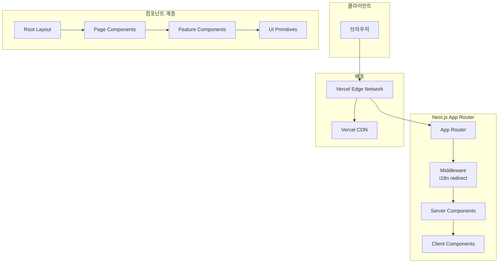
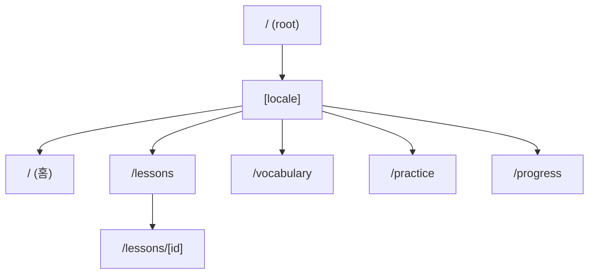
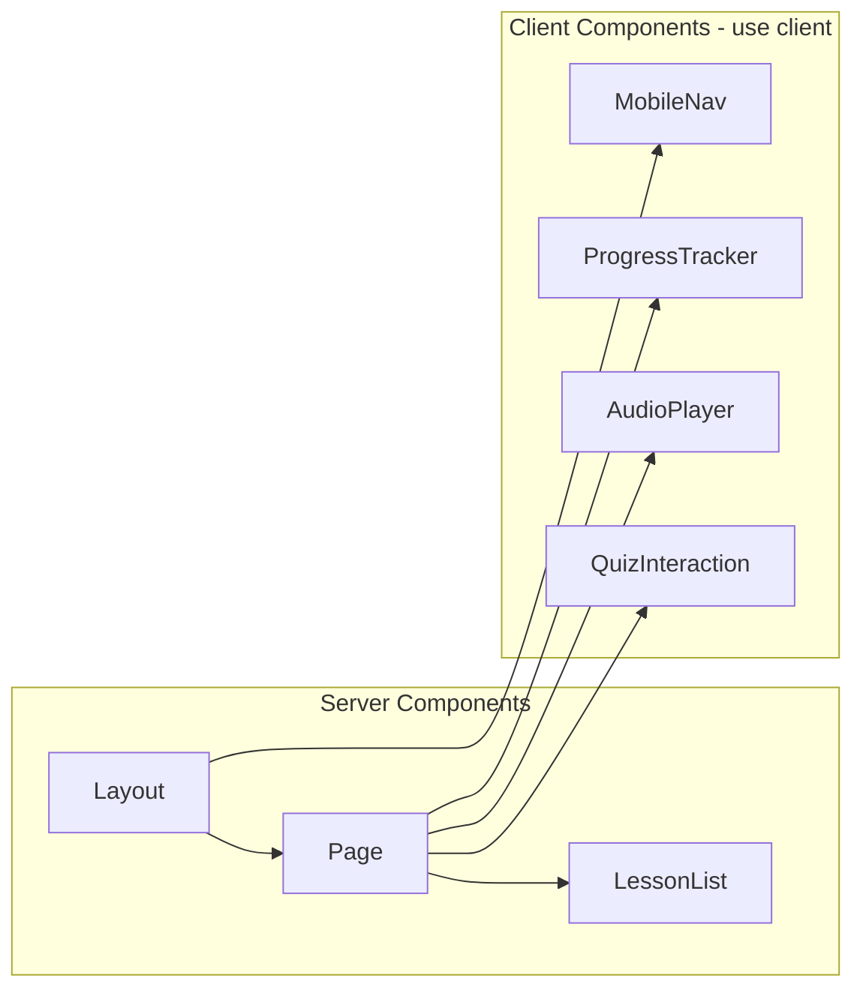
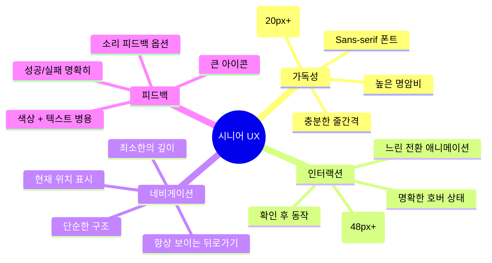
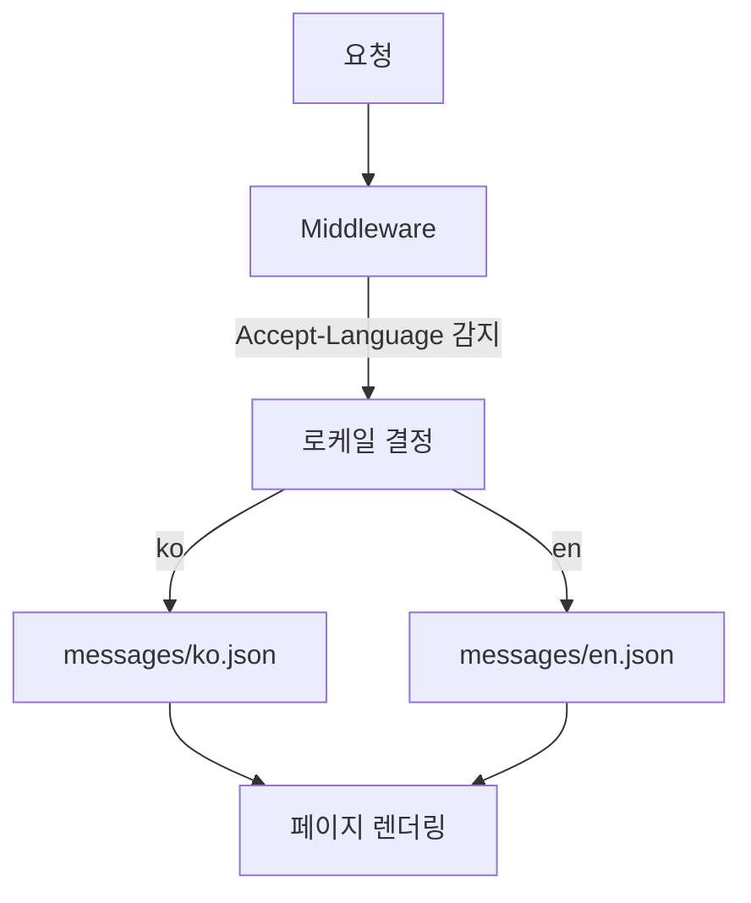
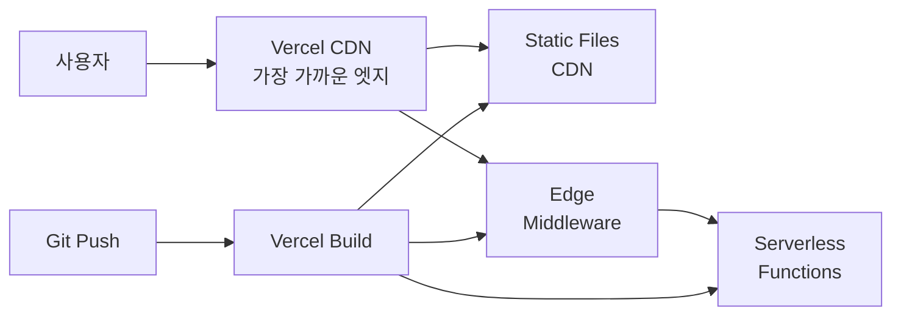

# Architecture

> Next.js App Router 구조, 컴포넌트 설계, 시니어 친화적 UI 아키텍처

## 전체 아키텍처



## Next.js App Router 구조

### 라우팅 구조



### 디렉토리 매핑

```
src/app/
├── layout.tsx              # 루트 레이아웃 (메타데이터, 폰트, 테마)
├── page.tsx                # 루트 페이지 (locale redirect)
├── globals.css             # 글로벌 CSS 변수
├── [locale]/
│   ├── layout.tsx          # 로케일별 레이아웃 (i18n provider, nav)
│   ├── page.tsx            # 홈페이지 (학습 대시보드)
│   ├── lessons/
│   │   ├── page.tsx        # 레슨 목록
│   │   └── [id]/
│   │       └── page.tsx    # 개별 레슨 페이지
│   ├── vocabulary/
│   │   └── page.tsx        # 단어 학습
│   ├── practice/
│   │   └── page.tsx        # 연습 문제
│   └── progress/
│       └── page.tsx        # 학습 진행률
```

### Server vs Client Components

| 컴포넌트 유형 | 사용 위치 | 이유 |
|-------------|----------|------|
| Server Component | 레이아웃, 페이지 | SEO, 초기 로딩 성능, 데이터 fetching |
| Client Component | 인터랙티브 UI | 사용자 입력, 상태 관리, 이벤트 핸들링 |



## 컴포넌트 설계

### 컴포넌트 계층 구조

```
components/
├── ui/                     # 1. UI Primitives (shadcn 스타일)
│   ├── button.tsx          #    재사용 가능한 기본 컴포넌트
│   ├── card.tsx
│   ├── badge.tsx
│   ├── dialog.tsx
│   └── progress.tsx
├── layout/                 # 2. Layout Components
│   ├── header.tsx          #    페이지 구조 컴포넌트
│   ├── footer.tsx
│   ├── sidebar.tsx
│   └── nav.tsx
├── features/               # 3. Feature Components
│   ├── lesson-card.tsx     #    비즈니스 로직 포함 컴포넌트
│   ├── vocabulary.tsx
│   ├── quiz.tsx
│   ├── audio-player.tsx
│   └── progress-bar.tsx
└── providers/              # 4. Provider Components
    ├── theme-provider.tsx
    └── i18n-provider.tsx
```

### 시니어 친화적 컴포넌트 설계 원칙



### 버튼 컴포넌트 예시

```tsx
// components/ui/button.tsx
// 시니어 친화적: 큰 크기, 높은 명암비, 명확한 레이블

interface ButtonProps {
  variant?: "primary" | "secondary" | "outline";
  size?: "default" | "lg" | "xl"; // xl = 시니어용 큰 버튼
  children: React.ReactNode;
}

// size="xl"일 때:
// - min-height: 56px
// - font-size: 20px
// - padding: 16px 32px
// - border-radius: 12px
```

## 국제화 (i18n) 아키텍처



### 메시지 파일 구조

```json
// messages/ko.json
{
  "home": {
    "title": "스페인어 학습",
    "subtitle": "오늘도 함께 배워볼까요?",
    "startLesson": "학습 시작하기"
  },
  "lessons": {
    "title": "레슨 목록",
    "lesson1": "인사하기",
    "lesson2": "자기소개"
  }
}
```

## 성능 최적화

| 기법 | 설명 |
|------|------|
| SSR/SSG | Server Components로 초기 로딩 최적화 |
| Image Optimization | next/image로 자동 최적화 |
| Font Optimization | next/font로 폰트 최적화 |
| Code Splitting | 페이지별 자동 코드 분할 |
| Prefetching | Link 컴포넌트의 자동 프리페칭 |
| Edge Runtime | Vercel Edge에서 실행으로 낮은 지연시간 |

## Vercel 배포 아키텍처


